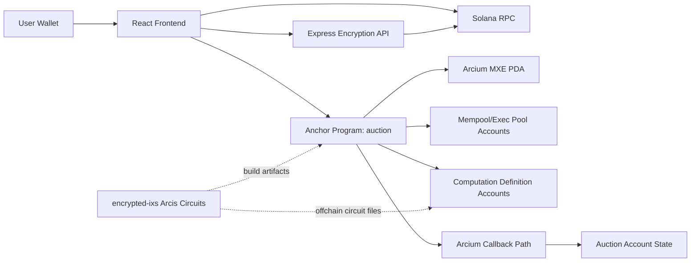

# MPC Auction

A sealed-bid auction application built on Solana + Arcium MPC.

This repository contains:
- an Anchor program for auction lifecycle and Arcium computation queueing
- Arcis encrypted instructions for private bid handling and winner computation
- a React frontend connected to devnet
- an Express API for bid encryption utilities

## Scope

The auction flow is:
1. Create auction
2. Submit encrypted bid
3. Close auction
4. Compute winner through Arcium MPC
5. Reveal winner and payment amount

Only the output needed for settlement is revealed.

## System Architecture



## On-Chain Components

### Solana Program
- Path: `programs/auction/src/lib.rs`
- Responsibilities:
- create/close auction
- queue Arcium computations (`init_auction_state`, `place_bid`, winner computations)
- verify callback outputs and update auction state

### Encrypted Instructions
- Path: `encrypted-ixs/src/lib.rs`
- Built into `.arcis` artifacts in `build/`
- Used for MPC logic:
- `init_auction_state`
- `place_bid`
- `determine_winner_first_price`
- `determine_winner_vickrey`

### Arcium Accounts
Derived and used at runtime:
- MXE account
- Cluster account
- Mempool / executing pool
- Computation account
- Computation definition account
- Fee pool / clock accounts

## Offchain Components

### Frontend
- Path: `src/`
- Stack: React + Vite + Solana wallet adapter
- Main files:
- `src/utils/programInstructions.js`: on-chain instruction calls
- `src/utils/arciumEncryption.js`: encryption API client
- `src/utils/solanaConnection.js`: RPC and connection settings
- `src/components/*`: auction UI flow

### Backend API
- Path: `api/`
- Entry: `api/server.js`
- Routes: `api/routes/encryption.js`
- Responsibilities:
- expose encryption endpoints
- fetch/derive MXE-related public material needed for encryption

## Workspace Structure

```text
mpc-auction/
├── api/
│   ├── routes/
│   │   └── encryption.js
│   ├── package.json
│   └── server.js
├── encrypted-ixs/
│   ├── src/
│   │   └── lib.rs
│   └── Cargo.toml
├── programs/
│   └── auction/
│       ├── src/
│       │   └── lib.rs
│       └── Cargo.toml
├── scripts/
│   ├── init-comp-defs.ts
│   └── finalize-comp-defs.ts
├── src/
│   ├── components/
│   │   ├── AuctionCard.jsx
│   │   ├── AuctionCreator.jsx
│   │   ├── AuctionList.jsx
│   │   ├── BidSubmission.jsx
│   │   ├── CountdownTimer.jsx
│   │   ├── WalletConnect.jsx
│   │   └── WinnerReveal.jsx
│   ├── idl/
│   │   └── auction.json
│   ├── utils/
│   │   ├── arciumEncryption.js
│   │   ├── blockchainIndexer.js
│   │   ├── helpers.js
│   │   ├── programInstructions.js
│   │   └── solanaConnection.js
│   ├── App.jsx
│   └── main.jsx
├── tests/
│   └── auction.ts
├── Anchor.toml
├── Arcium.toml
├── Cargo.toml
└── package.json
```

## Local Development

### Prerequisites
- Node.js 18+
- Rust + Cargo
- Solana CLI
- Anchor CLI `0.32.1`
- Arcium CLI `0.9.2`

### Install

```bash
npm install --legacy-peer-deps
cd api && npm install
```

### Upgrade tooling to Arcium 0.9.2

If your local machine is still on an older Arcium release, update tooling first:

```bash
arcup self update
arcup update
arcium --version
```

Expected version:

```bash
arcium 0.9.2
```

### Run frontend + backend

Terminal 1:
```bash
cd api
npm run dev
```

Terminal 2:
```bash
npm run dev
```

## Build and Test

### Build

```bash
arcium build
```

### Local integration test

```bash
arcium test
```

### Devnet test

```bash
arcium test -c devnet --skip-build
```

## Deployment (Devnet)

### 1. Deploy Solana program

```bash
solana program deploy target/deploy/auction.so \
  --program-id target/deploy/auction-keypair.json \
  --url devnet \
  --keypair ~/.config/solana/id.json \
  --use-rpc
```

### 2. Initialize / configure MXE for the program

```bash
arcium deploy --skip-deploy \
  --cluster-offset 456 \
  --recovery-set-size 4 \
  --keypair-path ~/.config/solana/id.json \
  --rpc-url <reliable-devnet-rpc>
```

### 3. Initialize computation definitions

```bash
ANCHOR_PROVIDER_URL=https://api.devnet.solana.com \
ANCHOR_WALLET=~/.config/solana/id.json \
yarn node --loader ts-node/esm scripts/init-comp-defs.ts
```

### 4. Optional: finalize/upload comp-def circuit data

```bash
ANCHOR_PROVIDER_URL=https://api.devnet.solana.com \
ANCHOR_WALLET=~/.config/solana/id.json \
yarn node --loader ts-node/esm scripts/finalize-comp-defs.ts
```

## Runtime Configuration

### Backend (`api/.env`)

```env
PORT=4000
NODE_ENV=development
PROGRAM_ID=<deployed-program-id>
CLUSTER_OFFSET=456
SOLANA_RPC_URL=https://api.devnet.solana.com
```

### Frontend env (optional)

Use `.env.local` in repo root:

```env
VITE_ENCRYPTION_API_BASE_URL=http://localhost:4000/api/encryption
VITE_RPC_URL=https://api.devnet.solana.com
```

## Notes on State and UX

- Frontend auction cards are merged from local storage and indexed chain activity.
- Deleting an auction in UI removes local persisted card data only.
- Auction creation supports either an uploaded local image file or a direct image URL.
- On-chain accounts and transactions remain unchanged.


## Devnet Readiness

Current devnet flow requires:
- program deployed to devnet
- MXE initialized for the program
- utility keys finalized
- computation definitions initialized

If MXE utility keys are still unset, finalize them with:

```bash
arcium mxe-info <program-id> \
  --cluster-offset 456 \
  --rpc-url <reliable-devnet-rpc>
```

`mxe-keys` / `finalize-mxe-keys` are part of the old 0.8-era workflow. In `0.9.2`, key visibility is folded into `mxe-info`.

## Arcium 0.9.2 Migration Notes

This repository is pinned to the following Arcium versions:

- `@arcium-hq/client@0.9.2`
- `arcium-client = 0.9.2`
- `arcium-macros = 0.9.2`
- `arcium-anchor = 0.9.2`
- `arcis = 0.9.2`

Key CLI changes from 0.8.x to 0.9.2:

- Short keypair flag changed from `-kp` to `-k`
- `--keypair-path` is unchanged
- `--authority` was removed from `deploy` and `init-mxe`
- `mxe-keys` was merged into `mxe-info`

Recommended migration verification:

```bash
arcium build
cargo check --all
arcium test
```

## Production Deployment

### Frontend (Vercel)

Project settings:
- Framework Preset: `Vite`
- Build Command: `npm run build`
- Output Directory: `dist`

Environment variables:

```env
VITE_RPC_URL=https://api.devnet.solana.com
VITE_ENCRYPTION_API_BASE_URL=https://<your-render-backend>/api/encryption
```

### Backend (Render)

Project settings:
- Runtime: `Node`
- Root Directory: `api`
- Build Command: `npm install`
- Start Command: `npm start`

Environment variables:

```env
PORT=4000
NODE_ENV=production
PROGRAM_ID=<deployed-program-id>
CLUSTER_OFFSET=456
SOLANA_RPC_URL=https://api.devnet.solana.com
CORS_ORIGINS=https://<your-vercel-app-domain>
```

### Post-deploy verification

1. Create auction from frontend.
2. Submit encrypted bid.
3. Finalize auction and verify winner reveal.
4. Confirm backend `/api/encryption/mxe-pubkey` returns success.

## License

MIT

